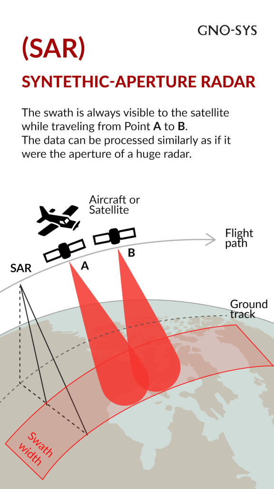
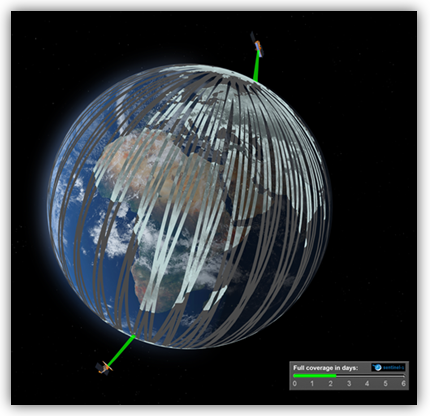
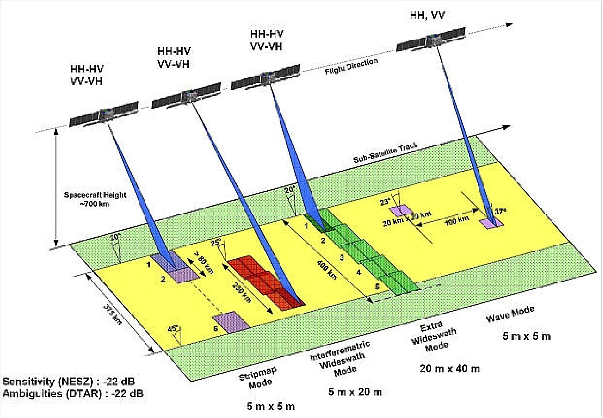
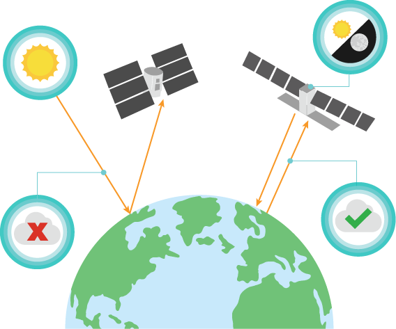
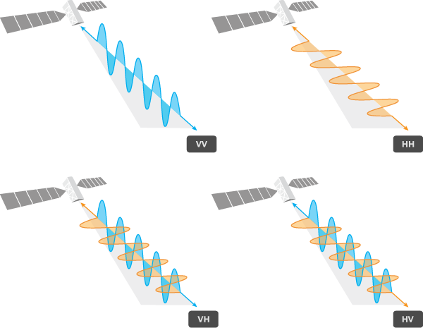
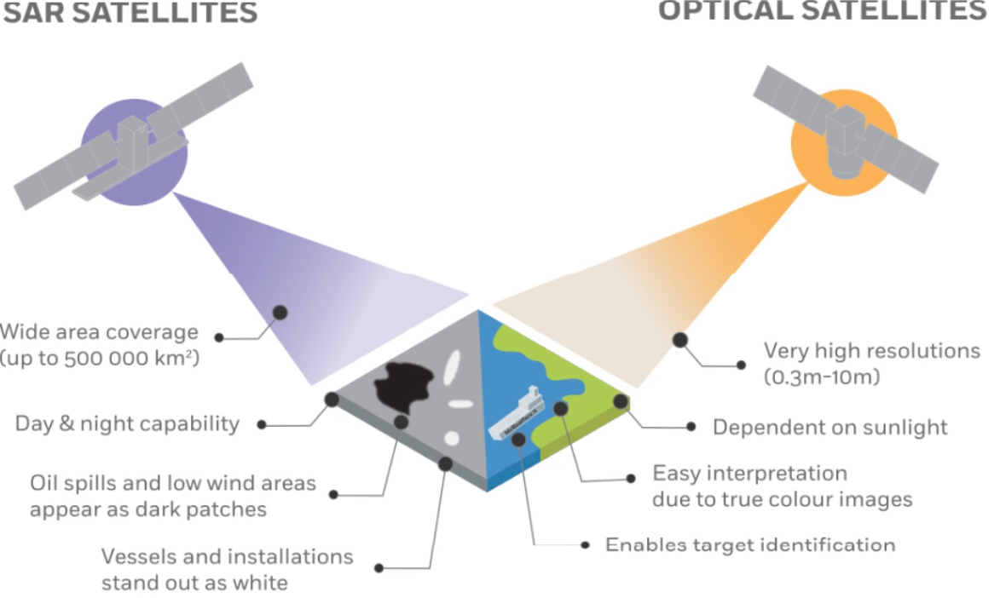
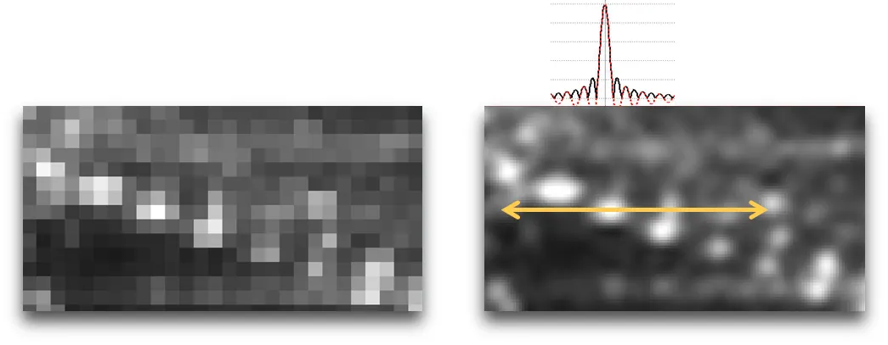

```{r setup, include=FALSE}
options(htmltools.dir.version = FALSE)
xaringanExtra::use_panelset()
```

<style>

strong, b {
color: #005587;
}

.panelset {
--panel-tab-font-size: 0.6em;
--panel-tab-active-foreground: #005587;
--panel-tab-active-border-color: #005587;
--panel-tab-hover-border-color: #007bc3;
--panel-tab-font-family: "Arial", sans-serif;
}


.panel-panel table {
font-size: 0.65em;
width: 100%;
border-collapse: collapse;
margin-top: 20px;
margin-bottom: 10px;
}

.panel-panel th {
border-bottom: 2px solid #005587;
color: #005587;
padding: 10px;
text-align: left;
}

.panel-panel td {
padding: 20px;
border-bottom: 1px solid #eee;
}


a {
color: #007bc3;
text-decoration: none;
}

a:hover {
text-decoration: underline;
}


.remark-slide-content {
font-size: 20px;
padding: 1em 2em 1em 2em;
}

.left-60 {
  float: left;
  width: 60%;
}

.right-40 {
  float: right;
  width: 38%;
}

.remark-slide-content::after {
  content: "";
  clear: both;
  display: table;
}

strong, b {
  color: #005587;
}
</style>

# Copernicus: Sentinel-1 — The SAR Imaging Constellation

.panelset[

.panel[.panel-name[Copernicus Programme]

- **Joint Initiative**: The Sentinel-1 mission is the European Radar Observatory for the Copernicus initiative, a collaboration between the **European Commission (EC)** and the **European Space Agency (ESA)**.
- **Core Objective**: Copernicus is designed to implement **information services** for environmental monitoring and security.
- **Data Integration**: It relies on a combination of **Earth Observation satellites** (Sentinels) and ground-based (in-situ) information.

.center[
<a href="https://sentiwiki.copernicus.eu/web/copernicus-programme">
  
</a>
<p style="font-size: 10px; color: grey;">
  [Credits: <a href="https://sentiwiki.copernicus.eu/web/copernicus-programme">ESA</a>]. 
  Source: <a href="https://sentiwiki.copernicus.eu/web/s1-mission#Sentinel-1-Mission">Copernicus SentiWiki (2024)</a>.
</p>
]
]

.panel[.panel-name[Sentinel-1 Mission]

- **The Fleet**: A constellation of **twin satellites** (Sentinel-1A & 1B) designed for the Copernicus program.
- **Sensor Technology**: Each carries a **C-band Synthetic Aperture Radar (SAR)**.
- **Key Capabilities**: 
    - Provides **all-weather, day-and-night** imagery.
    - **Revisit Time**: The twins orbit 180° apart, imaging the entire Earth every **six days**.
- **Launch History**: S1A launched in April 2014; S1B followed in April 2016.

.center[
<a href="https://www.eoportal.org/satellite-missions/copernicus-sentinel-1#copernicus-sentinel-1--the-sar-imaging-constellation-for-land-and-ocean-services">
  
</a>
<p style="font-size: 10px; color: grey;">
  Artist's view of S1 spacecraft. Image Credit: <a href="https://www.eoportal.org/satellite-missions/copernicus-sentinel-1">ESA/TAS-I</a>. 
  Source: <a href="https://www.earthdata.nasa.gov/data/platforms/space-based-platforms/sentinel-1">NASA Earthdata (2023)</a>.
</p>
]
]

.panel[.panel-name[SAR Technology]

- **Active Sensing**: Unlike passive systems (optical), SAR **produces its own energy** and measures the reflected signals (backscatter) from the Earth's surface.
- **Operational Advantage**: This "active" nature allows SAR to **overcome low visibility** and **adverse weather** (clouds, fog, rain).
- **High Resolution**: Delivers clear, high-resolution images in any environment, making it vital for defense and environmental science.

.center[
<a href="https://gno-sys.com/selecting-your-system-synthetic-aperture-radar-sar-technology/">
  
</a>
<p style="font-size: 10px; color: grey;">
  SAR active microwave sensing mechanism. 
  Source: <a href="https://gno-sys.com/selecting-your-system-synthetic-aperture-radar-sar-technology/">Gnosys Technology (2023)</a>.
</p>
]
]

]

---
# Sentinel-1 Radar Mission

.pull-left[

.panelset[

.panel[.panel-name[Mission Overview]

- **Deployment**: Sentinel-1 unfolds its **10-meter long solar wings** and radar antenna in a "carefully designed choreography" after separating from the Soyuz launcher [00:00:12].
- **Active Sensing**: As an **active system**, it illuminates the Earth with radar waves, enabling it to **see through clouds and rain**, regardless of day or night [00:00:33].
- **Efficiency**: A single pass can collect data across a swath of **250 to 400 km**, mapping the world at unprecedented speed and resolution [00:01:39].
]


.panel[.panel-name[Key Applications]

- **Emergency Management**: Critical for rapid response during **floods and earthquakes**, and detecting millimetric changes in volcanic activity [00:00:56].
- **Maritime Services**: Enhances global **ship traffic monitoring** and assists icebreakers in identifying safe navigation routes [00:01:12].
- **Operational Continuity**: Part of the **Copernicus program**, ensuring long-term, timely, and easy access to high-quality radar data [00:01:54].
]
]
]

.pull-right[
### Video Presentation
<div class="video-container">
  <iframe src="https://www.youtube.com/embed/FJWzLxdSMyA?start=2" frameborder="0" allow="accelerometer; autoplay; clipboard-write; encrypted-media; gyroscope; picture-in-picture" allowfullscreen></iframe>
</div>

<p style="font-size: 10px; color: grey; margin-top: 10px;">
  Source: <a href="https://www.youtube.com/watch?v=FJWzLxdSMyA">ESA - Sentinel-1: Radar mission (2014)</a>
</p>
]

<style>
/* Applying your preferred bold style */
strong, b {
  color: #005587;
}

/* Responsive video container for 16:9 ratio */
.video-container {
  position: relative;
  padding-bottom: 56.25%;
  height: 0;
  overflow: hidden;
}

.video-container iframe {
  position: absolute;
  top: 0;
  left: 0;
  width: 100%;
  height: 100%;
  border-radius: 8px;
}
</style>

---
# Mission Profile

.pull-left[
.panelset[

.panel[.panel-name[Info]

| Attribute | Details |
| :--- | :--- |
| **Mission Name** | Copernicus Sentinel-1 (S1A, S1B, S1C, S1D) |
| **Agency** | **ESA**; European Commission (COM) |
| **Status** | **Operational** (S1A: Extended; S1B: Ended; S1C: Commissioning) |
| **Launch Dates** | S1A: Apr 2014 \ S1B: Apr 2016 \ S1C: Dec 2024 |
| **Design Life** | **7.25 Years** (Consumables for 12 years) |

]

.panel[.panel-name[Specifications]

| Attribute | Details |
| :--- | :--- |
| **Resolution** | 5 x 5 m, 5 x 20 m, and 25 x 40 m |
| **Spectral** | **C-band** (5.405 GHz) |
| **Mass** | ~2,300 kg (at launch) |
| **Data Policy** | **Free, Full, and Open** (Copernicus) |

]

.panel[.panel-name[Orbits]

| Attribute | Details |
| :--- | :--- |
| **Orbit Type** | **Sun-synchronous**, Near-polar |
| **LTAN** | Dawn-dusk (18:00) |
| **Altitude** | 693 km |
| **Inclination** | 98.18° |
| **Repeat Cycle** | 12 days (Single); **6 days** (Constellation) |

]

.panel[.panel-name[Instruments]

| Attribute | Details |
| :--- | :--- |
| **Primary** | **C-SAR** (Synthetic Aperture Radar) |
| **Frequency** | 5.405 GHz |
| **Polarization** | Single (HH, VV) & **Dual** (HH+HV, VV+VH) |

]
]
]

.pull-right[
.center[
<a href="https://sentiwiki.copernicus.eu/web/s1-mission" target="_blank">
  
</a>
<p style="font-size: 10px; color: grey;">Sentinel-1 Constellation [Credits: <a href="https://sentiwiki.copernicus.eu/web/s1-mission">ESA/ATG medialab</a>]</p>


<a href="https://sentiwiki.copernicus.eu/web/s1-mission#Sentinel-1-Mission" target="_blank">
  
</a>
<p style="font-size: 10px; color: grey;">Schematic View of Deployed S-1 [Credits: <a href="https://sentiwiki.copernicus.eu/web/s1-mission#Sentinel-1-Mission">TAS-I</a>]</p>
]
]

---
# Technical Specifications - Sensor Modes

Copernicus Sentinel-1 operates in **four exclusive acquisition modes** to balance swath width and resolution:


| Mode | Swath | Res (Rg x Az) | Primary Use Case |
| :--- | :--- | :--- | :--- |
| **IW** (Interferometric Wide) | 250 km | 5 x 20 m | **Main land mode**; InSAR. |
| **EW** (Extra Wide Swath) | 400 km | 20 x 40 m | Maritime, sea-ice, polar. |
| **SM** (Stripmap) | 80 km | 5 x 5 m | High-res emergency cases. |
| **WV** (Wave) | 20 x 20 km | 5 x 5 m | Ocean wind/waves (sampled). |


.center[
<a href="https://www.eoportal.org/satellite-missions/copernicus-sentinel-1#c-sar-c-band-sar-instrument" target="_blank">
  
</a>
<p style="font-size: 10px; color: grey; margin-top: 15px;">
  Overview of Sentinel-1 C-SAR observation scheme. <br/> Image credit: <a href="https://www.eoportal.org/satellite-missions/copernicus-sentinel-1">ESA / eoPortal</a>
</p>
]


---
# Mechanisms - SAR

<style>

.panel-panel {
  position: relative;
  height: 400px; 
}

.panel-content-text {
  width: 58%;
  float: left;
}

.panel-content-image {
  width: 38%;
  float: right;
  text-align: center;
}

strong, b { color: #005587; }

.clearfix::after {
  content: "";
  clear: both;
  display: table;
}
</style>

.panelset[

.panel[.panel-name[Active Sensing]
.panel-content-text[
### Active vs. Passive Sensing
- **Passive**: Records solar radiation reflected from the ground.
- **Active (SAR)**: Functions as both **source and receiver**.
- **Advantage**: Operates **day/night** and penetrates clouds/fog.
]
.panel-content-image[
<a href="https://pro.arcgis.com/en/pro-app/latest/help/analysis/image-analyst/introduction-to-synthetic-aperture-radar.htm" target="_blank">
  
</a>
<p style="font-size: 8px; color: grey;">Active vs Passive. Source: ArcGIS Pro.</p>
]
]

.panel[.panel-name[Polarization]
.panel-content-text[
### Signal Orientation
- **Single Pol**: HH or VV.
- **Cross Pol**: HV or VH.
- **Vertical (V)**: Detects **elevated objects** (buildings, rough seas).
- **Horizontal (H)**: Suitable for **flat surfaces** (rivers).
]
.panel-content-image[
<a href="https://pro.arcgis.com/en/pro-app/latest/help/analysis/image-analyst/introduction-to-synthetic-aperture-radar.htm" target="_blank">
  
</a>
<p style="font-size: 8px; color: grey;">SAR Polarization. Source: ArcGIS Pro.</p>
]
]

.panel[.panel-name[Spatial Resolution]
.panel-content-text[
### Synthetic Aperture
- **Concept**: A short antenna mimics a **kilometers-long** one.
- **Mechanism**: Signal processing **synthetically elongates** the antenna.
]
.panel-content-image[
<a href="https://pro.arcgis.com/en/pro-app/latest/help/analysis/image-analyst/introduction-to-synthetic-aperture-radar.htm" target="_blank">
  
</a>
<p style="font-size: 8px; color: grey;">Synthetic Aperture formation. Source: ArcGIS Pro.</p>
]
]

] .clearfix[]

---
# Comparison - Optical and SAR

.left-60[

<br>

| Feature | Optical Imagery | SAR Imagery |
| :--- | :--- | :--- |
| **Energy Source** | **Passive** (Sunlight) | **Active** (Radar pulses) |
| **Illumination** | Requires daylight | **Works 24/7** |
| **Atmospheric** | Blocked by clouds/smoke | **Penetrates** clouds/rain |
| **Image Basis** | Reflectance (Vis/IR) | Backscatter (Microwave) |
| **Interpretation** | **Visual Traits**: Color, size, form. | **Physical**: Structure, material. |


]

.right-40[
<br>
.center[
<a href="https://www.youtube.com/watch?v=ecfkPuSe45Y" target="_blank">
  
</a>
<p style="font-size: 9px; color: grey; margin-top: 10px;">
  Conceptual Comparison: SAR vs. Optical. <br/> Source: <a href="https://www.youtube.com/watch?v=ecfkPuSe45Y">Everything Earth Observation</a>
</p>
]
]

.clearfix[]


---
# Sentinel-1 C-SAR Application Portfolio

.scroll-box[

| Category | Application | Key Features & Technical Utility | Source Reference / Article | URL |
| :--- | :--- | :--- | :--- | :--- |
| **Land Monitoring** | **Forestry** | Mapping forest extent and monitoring deforestation/degradation using C-band backscatter. | SOFT: Synergetic Operational Forest Monitoring | [Link](https://eo4society.esa.int/projects/soft/) |
| **Land Monitoring** | **Agriculture** | Monitoring phenological cycles and crop classification through multi-temporal VV/VH ratios. | Crop changes over one year | [Link](https://www.esa.int/ESA_Multimedia/Images/2021/02/Crop_changes_over_one_year) |
| **Land Monitoring** | **Urban Deformation** | Utilizing InSAR to detect structural integrity and ground stability following major incidents. | Beirut explosion: radar analysis | [Link](https://www.earthstartsbeating.com/2020/08/11/beirutexplosion/) |
| **Land Monitoring** | **Landscape Topography** | Generating high-resolution digital elevation models and global backscatter mosaics (S1GBM). | Sentinel-1 Global Backscatter Model | [Link](https://sentiwiki.copernicus.eu/web/s1-products#Sentinel-1-Global-Backscatter-Model-(S1GBM)) |
| **Land Monitoring** | **Soil Moisture** | Retrieval of Surface Soil Moisture (SSM) by analyzing sensitivity of backscatter to water content. | Copernicus Global Land: Soil Moisture | [Link](https://land.copernicus.eu/global/products/ssm) |
| **Land Monitoring** | **Vegetation** | Tracking vegetation optical depth and biomass changes via time-series SAR indices. | SentiWiki: Vegetation Monitoring | [Link](https://sentiwiki.copernicus.eu/web/s1-applications#Vegetation) |
| **Maritime Monitoring** | **Ice Monitoring** | Tracking sea-ice concentration, type, and iceberg drift to ensure safe polar navigation. | Sentinel-1: Antarctic sea ice and sheets | [Link](https://www.youtube.com/watch?v=cpYrnP_B3qc) |
| **Maritime Monitoring** | **Ship Monitoring** | Near real-time detection of vessels and shipping lanes, regardless of AIS transponder status. | Bay of Naples: Shipping from Space | [Link](https://www.esa.int/ESA_Multimedia/Images/2020/07/Bay_of_Naples_Italy) |
| **Maritime Monitoring** | **Oil Pollution** | Detection of oil slicks (dampening of capillary waves) for environmental enforcement. | Oil spill spread detection | [Link](https://www.esa.int/ESA_Multimedia/Images/2018/10/Oil_spill_spread) |
| **Maritime Monitoring** | **Waves and Winds** | Extracting ocean swell spectra and wind speed vectors using SAR Wave (WV) mode. | Medicanes: Monitoring Numa | [Link](https://www.earthstartsbeating.com/2017/11/24/medicanes-numa/) |
| **Emergency Management** | **Flood Monitoring** | Rapid mapping of water-covered areas during extreme weather events and cloud cover. | Copernicus Emergency Management Service | [Link](https://emergency.copernicus.eu/) |
| **Emergency Management** | **Earthquake Analysis** | Mapping co-seismic surface displacement and fault lines using D-InSAR techniques. | Türkiye/Syria Earthquakes impact | [Link](https://www.esa.int/Applications/Observing_the_Earth/Satellites_support_impact_assessment_after_Tuerkiye_Syria_earthquakes) |
| **Emergency Management** | **Landslide / Volcano** | Monitoring pre-eruptive ground inflation and slope stability to mitigate geological risks. | Evaluating ground deformation via S-1 | [Link](https://www.linkedin.com/pulse/using-sentinel-1-satellite-evaluate-ground-deformation-caused-/) |
]


.footnote[
[1] Bauer-Marschallinger, B., et al. (2021). [The normalised Sentinel-1 Global Backscatter Model...](https://doi.org/10.1038/s41597-021-01059-7) *Sci Data* 8, 277.  
[2] ESA, [Sentinel-1 Applications Guide](https://sentiwiki.copernicus.eu/web/s1-applications). *Copernicus SentiWiki*.
]


<style>
.scroll-box {
height: 420px;
overflow-y: scroll;
display: block;
}
/* Optional: ensures the table takes full width inside the scroll box */
.scroll-box table {
width: 100%;
}
.footnote {
  font-size: 0.8em;
  color: #777;
  position: absolute;
  bottom: 1em;
  left: 2em;
}
</style>


---
# Reflection: SAR Pros, Cons & Integration

.left-60[
.panelset[
.panel[.panel-name[Advantages]
- **All-weather & 24/7**: Penetrates clouds, smoke, and rain; independent of solar illumination.
- **Material Penetration**: Microwaves can "see through" foliage and dry soil to reveal subsurface structures.
- **High Dynamics**: Achieves up to **25cm resolution** with frequent revisits, ideal for urban expansion monitoring.
]

.panel[.panel-name[Limitations]
- **Speckle Noise**: Inherently affected by "salt and pepper" graininess, complicating fine-feature classification.
- **Technical Complexity**: Requires specialized processing for geometric and radiometric calibration.
- **Non-Intuitive**: Backscatter is sensitive to **roughness and moisture** (dielectric), not color, making visual interpretation harder.
]


.panel[.panel-name[Future Integration] 
- **Complementary Nature**: It’s not SAR *vs.* Optical; they are **complementary**. Combining SAR's structural data with Optical's spectral detail provides the most robust monitoring solution.
- **GIS Integration**: Adding GIS layers (land cover, boundaries) provides the necessary **spatial context** to turn radar backscatter into actionable intelligence.
]
]
]

.right-40[

<br>
.center[
<a href="https://elisecolin.medium.com/why-a-sar-image-is-not-your-usual-optical-one-2ee3f199c5ef" target="_blank">
  
</a>
<p style="font-size: 8px; color: grey; margin-top: 10px;">
  Spatial Resolution vs. Pixel Size in SAR. <br/> Source: <a href="https://elisecolin.medium.com/why-a-sar-image-is-not-your-usual-optical-one-2ee3f199c5ef">Elise Colin (Medium)</a>
</p>
]
]


<style>
.left-60 { float: left; width: 60%; }
.right-40 { float: right; width: 38%; }
.remark-slide-content strong { color: #005587; }
.panel-panel { font-size: 0.8em; line-height: 1.6; }
.footnote { font-size: 0.5em; color: #777; position: absolute; bottom: 1.5em; left: 3em; }
.clearfix::after { content: ""; clear: both; display: table; }
</style>

.clearfix[]